# Make a Raspberry Pi Into a LDAP Server

My reason for running a LDAP server is to learn how to use a directory service like **Active Directory**. 

## Scope
- Install and configure OpenLDAP Server
- Add account data and password to the LDAP database
- Use ldapsearch command to process searches in an LDAP directory server 
- Using Apache Directory Studio

## Pre-requisites
- Raspberry Pi running Raspbian OS


## Environment
The following is the data of my Raspberry Pi that runs OpenLDAP Server:
- **Distributor ID**: Debian
- **Description**: Debian GNU/Linux 12 (bookworm)
- **Release**: 12
- **Codename**: bookworm
- **All information of the Linux kernel**: Linux raspberrypi 6.6.62+rpt-rpi-v8 #1 SMP PREEMPT Debian 1:6.6.62-1+rpt1 (2024-11-25) aarch64 GNU/Linux

## 1. Install and Configure OpenLDAP
1. In “/etc/hosts”, add this to the file:
    ```
    127.0.1.1       rpipro.example.com      raspberrypi
    ```
2. Replace “rpipro.example.com” with something else you want.
3. Reboot the raspberry pi
4. Install the packages
    ```
    sudo apt-get update && sudo apt install slapd ldap-utils 
    ```
5. Enter the admin password of the user database "example.com" when prompted.

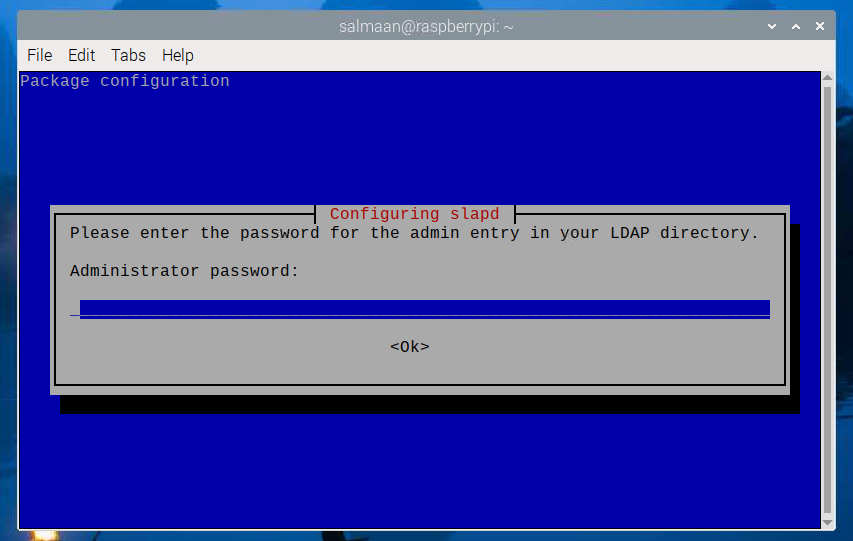

6. Test that the database "example.com" is created:
    ```
    ldapsearch -x -LLL -H ldap:/// -b dc=example,dc=com dn
    ```
7. OpenLDAP will reply with the following to indicate a database is created:

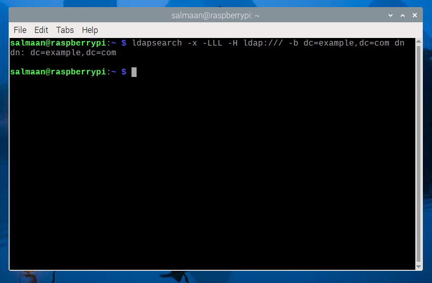

## 2. Add Account Data and Password to the LDAP Database

1. Create a file called “add_content.ldif”.
    ```
    touch add_content.ldif
    ```

2. Add the following content to “add_content.ldif”:
    ```
    dn: ou=People,dc=example,dc=com
    objectClass: organizationalUnit
    ou: People

    dn: ou=Groups,dc=example,dc=com
    objectClass: organizationalUnit
    ou: Groups

    dn: cn=miners,ou=Groups,dc=example,dc=com
    objectClass: posixGroup
    cn: john
    gidNumber: 10000

    dn: uid=john,ou=People,dc=example,dc=com
    objectClass: inetOrgPerson
    objectClass: posixAccount
    objectClass: shadowAccount
    uid: john
    sn: Doe
    givenName: John
    cn: John Doe
    displayName: John Doe
    uidNumber: 10000
    gidNumber: 10000
    userPassword: johnldap
    gecos: John Doe
    loginShell: /bin/bash
    homeDirectory: /home/ldap/john
    ```
3. Add the content to database "example.com":
    ```
    ldapadd -x -H ldap:/// -D cn=admin,dc=example,dc=com -W -f add_content.ldif
    ```

4. It will ask for the LDAP Password.
5. OpenLDAP will display:
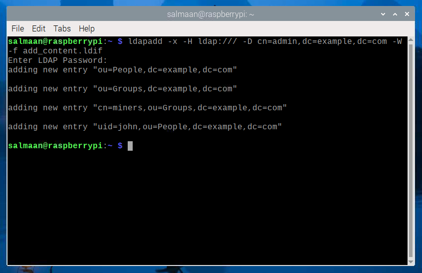

## 3. Test if the entry is in the database
1. Check that the entry with the uid “john” is actually in the database "example.com":
    ```
    ldapsearch -x -H ldap:/// -LLL -b dc=example,dc=com 'uid=john' cn gidNumber
    ```

2. OpenLDAP will display:
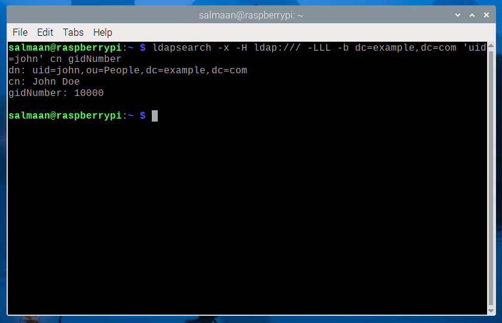

## 4. Using Apache Directory Studio

**Apache Directory Studio** is a GUI client used to manage users and groups for any LDAP server.

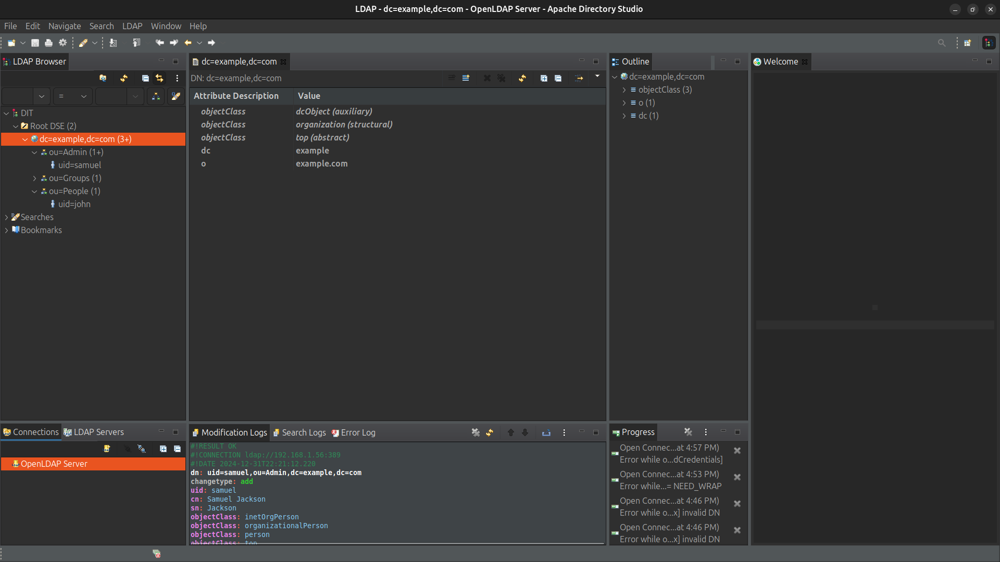

### 4.1 Setup Authentication

To set up authentication for Apache Directory Studio, you must set the **Bind DN or user** as “cn=admin,dc-example,dc=com” and set the **Bind password**.

1. Set the **Bind DN or user** as:
    ```
    cn=admin,dc-example,dc=com
    ```

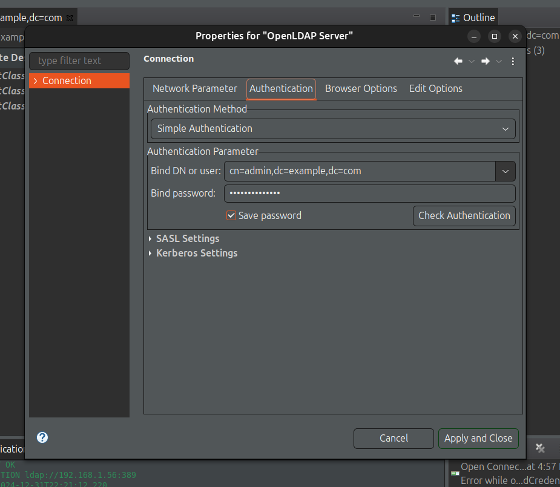

2. Click "Apply and Close".
3. You are able to add, update, and delete users and groups for the LDAP server with Apache Directory Studio.

### 4.2 Add Users and Groups
#### 4.2.1 Add a Group
1. Right click on entry containing “dc=example,dc=com” and click New -> New entry
2. Keep the option “Create entry from scratch” and click next.


3. Search up “organizational” and select “organizationalUnit”.
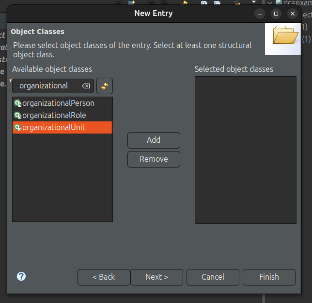

4. Add this object and click next.
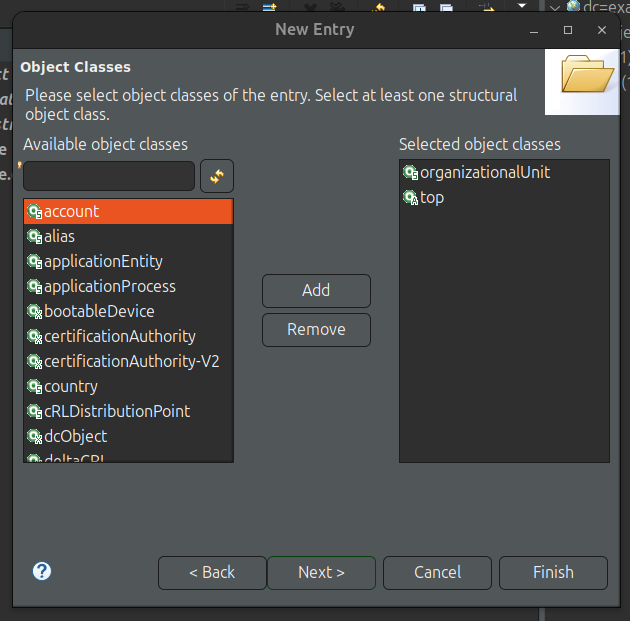

5. Set the ou to whatever you want, in my case I will set it to Admin2. When you are done, click next.
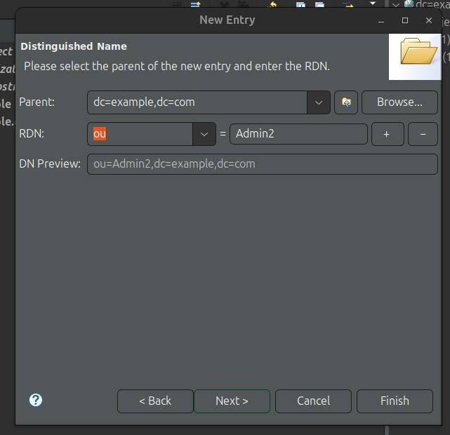

6. If the information looks correct to you, click finish.
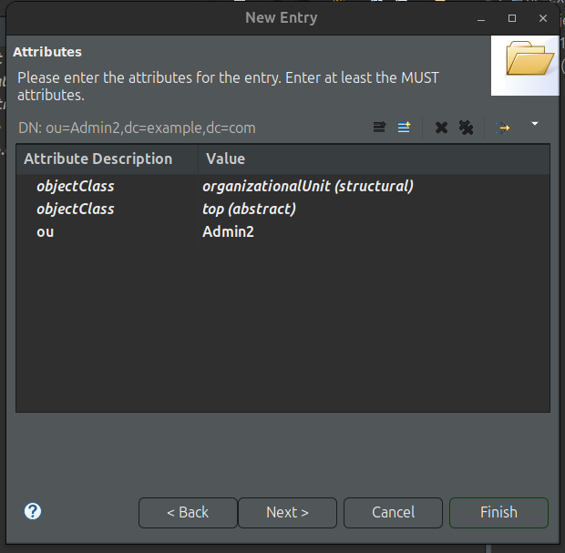

#### 4.2.2 Add a User to a Group
1. Right click on any group entry. In my case it would be called Admin. Then click New -> New entry.
2. Keep the option “Create entry from scratch” and click next.
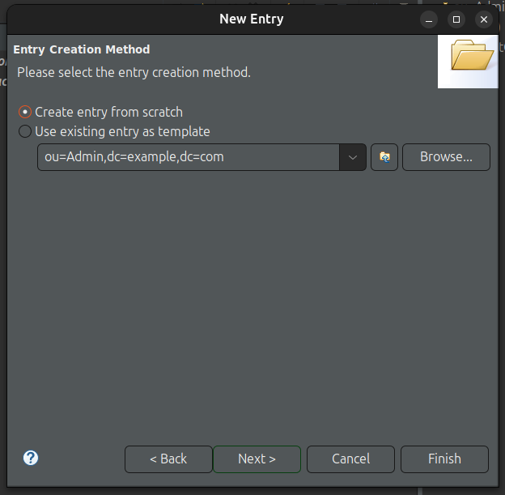

3. Search up “inet” and select “inetOrgPerson”.
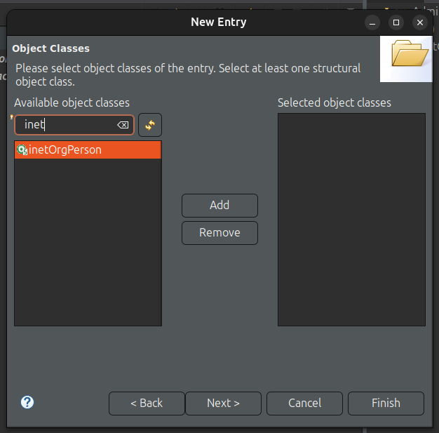

4. Add this object and click next.
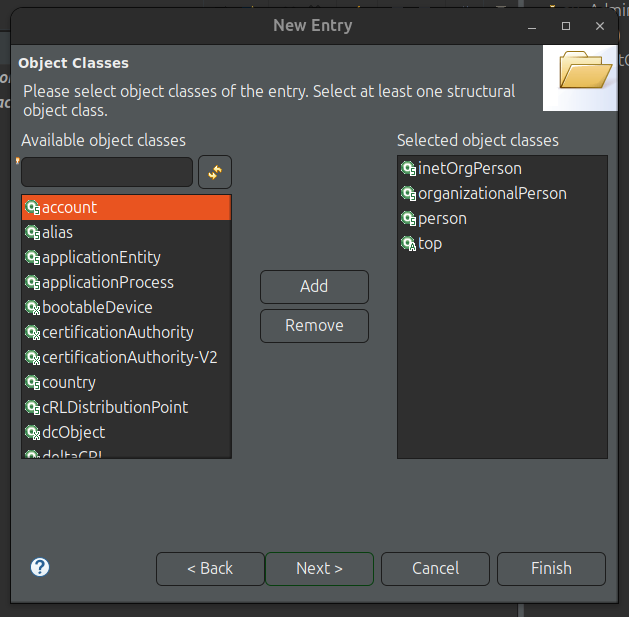

5. Set the uid to whatever you want, in my case I will set it to “sam”. When you are done, click next.
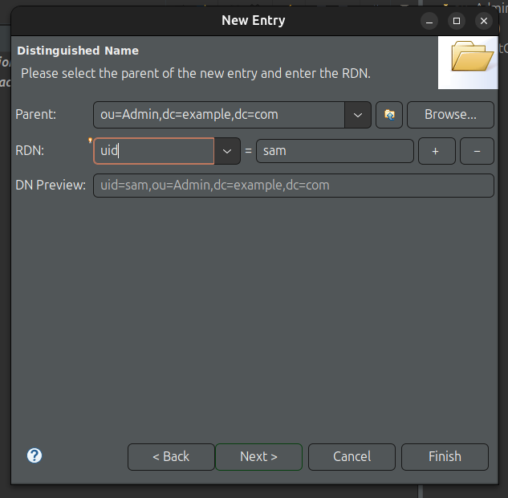

6. Set the cn, common name, value to a full name. I will use “Sam Paul” as the value for cn. 
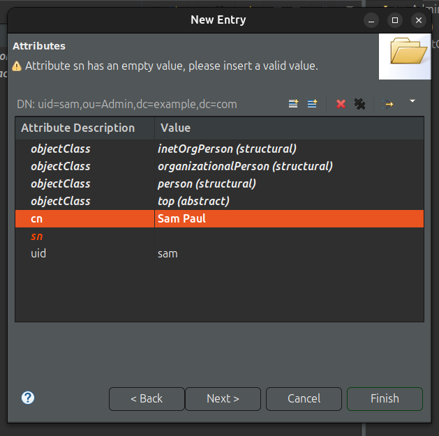

7. Set the sn, surname, value to a last name. I will use “Paul” as the value for sn.


8. If the information looks correct to you, click finish.
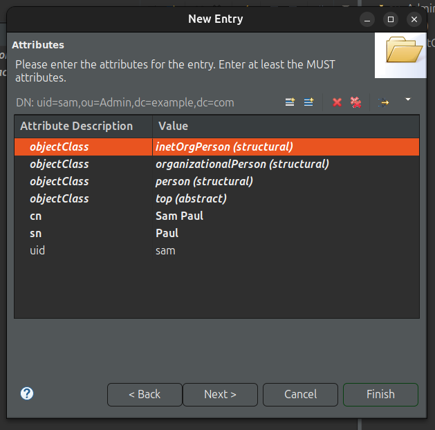

## Resources
- [Make Raspberry Pi Into a LDAP Server to Store User Account Data and Password - Autodesk Instructables](https://www.instructables.com/Make-Raspberry-Pi-into-a-LDAP-Server/) 
- [Install and configure LDAP - Ubuntu](https://ubuntu.com/server/docs/install-and-configure-ldap) 
- [Raspberry Pi openLDAP Server - The Urban Penguin](https://www.theurbanpenguin.com/raspberry-pi-openldap-server/) 
- [Creating Groups in OpenLDAP using Apache Directory Studio - Robert Munn](https://robertmunn.com/blog/creating-groups-in-openldap-using-apache-directory-studio/)
- [Adding People to Groups in OpenLDAP using Apache Directory Studio - Robert Munn](https://robertmunn.com/blog/adding-people-to-groups-in-openldap-using-apache-directory-studio/)
- [The ldapsearch Command-Line Tool - LDAP Documentation](https://docs.ldap.com/ldap-sdk/docs/tool-usages/ldapsearch.html)