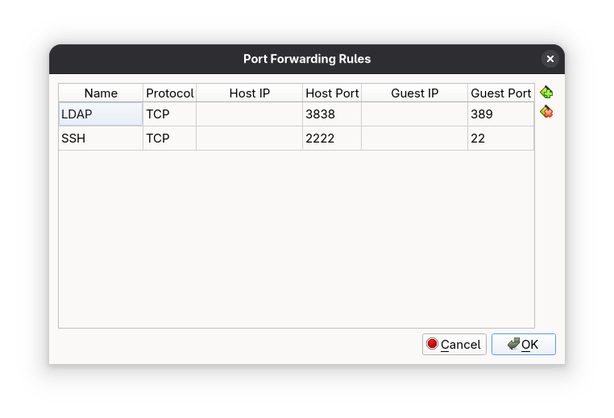
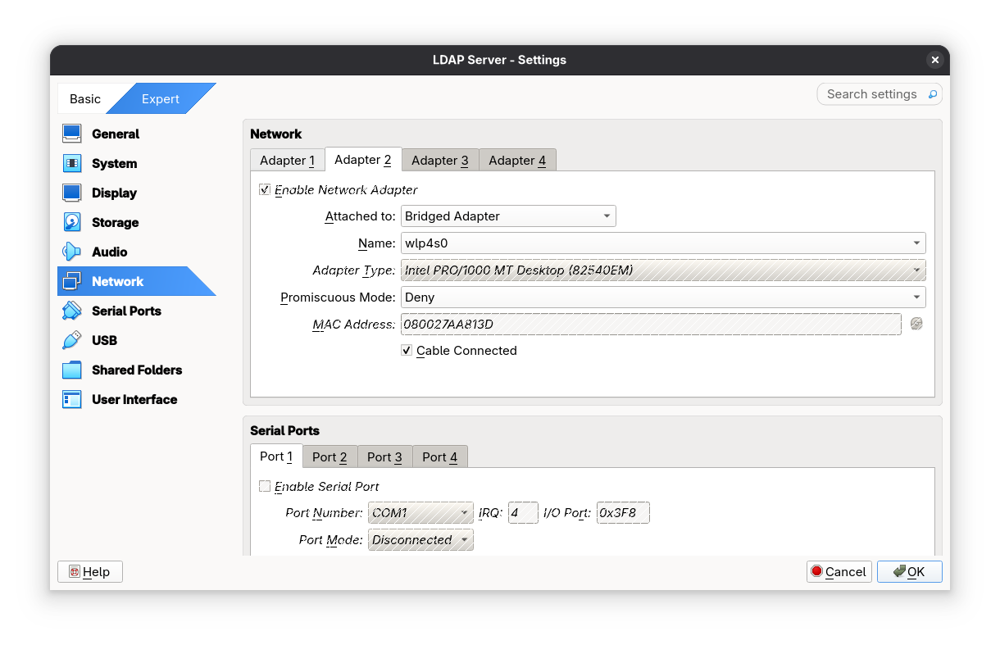
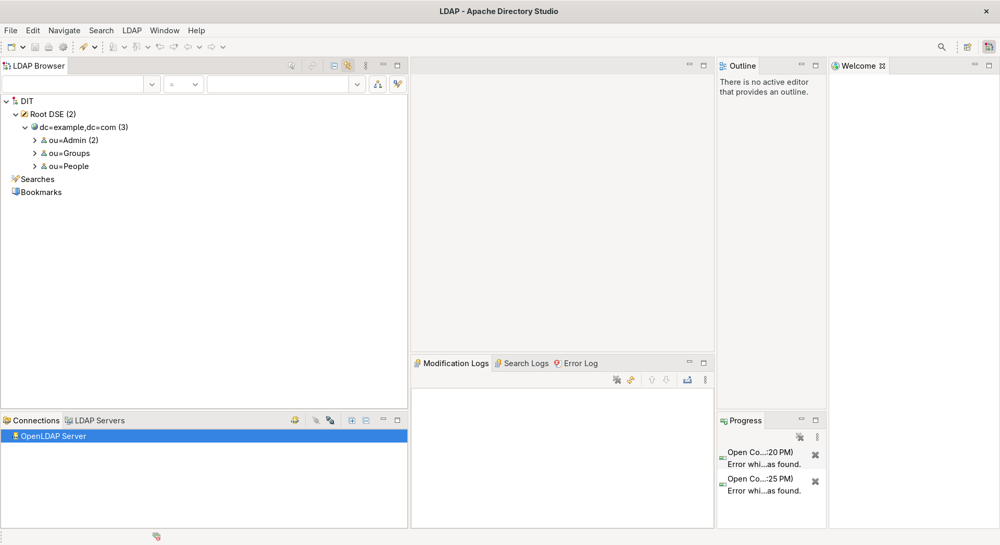

# Setup a LDAP Server (OpenLDAP)

My reason for running a LDAP server is to learn how to use a directory service like **Active Directory**. 

## Scope

- Install and configure OpenLDAP Server
- Using Apache Directory Studio
    - Setup Authentication
    - Add Users and Groups

## 1. Setup a Virtual Machine of Ubuntu

1. I will be using Linux Mint as my distro. 
2. Download an ISO of Linux Mint at https://linuxmint.com
3. Go to the Download page and download the latest version of Linux Mint.
4. Go to VirtualBox and create a new virtual machine.
5. Set the name of the virtual machine. Mine is called "LDAP Server"
6. Set the ISO image to the Linux Mint ISO.
7. Set the base memory. I set the Base Memory to "3072 MB". 
8. Set the number of CPUs (Processors). I set the number of CPUs to 2.
9. Set the size of the Hard Disk. I set the size of the Hard Disk to "34.00 GB".
10. Then click Finish.
11. Setup Linux Mint and add a username and password for it.

### 1. Install SSH
Install SSH
```
sudo apt install openssh-server
```

On VirtualBox, Right click on the Virtual Machine, go to "Settings...". Go to Network -> "Port Forwarding", and set the the port forwarding rules for the Virtual Machine:
- Name: SSH
- Protocol: TCP
- Host IP: ""
- Host Port: 2222
- Guest IP: ""
- Guest Port: 22



Stay on the settings of the Virtual Machine. Go to Network -> Adapter 2, and set it to "Bridged Adapter" for the Virtual Machine.



Make sure the port 2222 is open
```
nmap 192.168.56.1 -p 2222
```

SSH to the virtual machine
```
ssh sage@192.168.56.1 -p 2222
```

## 2. Install and Configure OpenLDAP

Install the packages for slapd
```
sudo apt install slapd ldap-utils
```

Change the Directory Information Tree (DIT) suffix
```
sudo dpkg-reconfigure slapd
```

Change the DNS domain name to
```
example.com
```

Test that the database "example.com" is created:
```
ldapsearch -x -LLL -H ldap:/// -b dc=example,dc=com dn
```

## 3. Add Account Data and Password to the LDAP Database

Install vim or any text editor you like
```
sudo apt install vim
```

Create a file called “add_content.ldif”.
```
touch add_content.ldif
```

Add the following content to “add_content.ldif”:
```
dn: ou=People,dc=example,dc=com
objectClass: organizationalUnit
ou: People

dn: ou=Groups,dc=example,dc=com
objectClass: organizationalUnit
ou: Groups

dn: cn=miners,ou=Groups,dc=example,dc=com
objectClass: posixGroup
cn: john
gidNumber: 10000

dn: uid=john,ou=People,dc=example,dc=com
objectClass: inetOrgPerson
objectClass: posixAccount
objectClass: shadowAccount
uid: john
sn: Doe
givenName: John
cn: John Doe
displayName: John Doe
uidNumber: 10000
gidNumber: 10000
userPassword: johnldap
gecos: John Doe
loginShell: /bin/bash
homeDirectory: /home/ldap/john
```

Add the content to database "example.com":
```
ldapadd -x -H ldap:/// -D cn=admin,dc=example,dc=com -W -f add_content.ldif
```

Check that the entry with the uid “john” is actually in the database "example.com":
```
ldapsearch -x -H ldap:/// -LLL -b dc=example,dc=com 'uid=john' cn gidNumber
```

## 4. Using Apache Directory Studio

**Apache Directory Studio** is a GUI client used to manage users and groups for any LDAP server.



On VirtualBox, Go to the settings of the Virtual Machine. Go to Network -> Port Forwarding, and set the the port forwarding rules for the Virtual Machine:
- Name: LDAP
- Protocol: TCP
- Host IP: ""
- Host Port: 3838
- Guest IP: ""
- Guest Port: 389


Check if the port 3838 is open
```
nmap 192.168.56.1 -p 3838
```

### 4.1 Setup Connection to the LDAP Server

Go to File -> New -> LDAP Browser -> LDAP Connection
Set the information for the New LDAP Connection
- Connection name: OpenLDAP Server
- Hostname: 192.168.56.1
- Port: 3838

Connection name:
```
OpenLDAP Server
```

Hostname:
```
192.168.56.1
```

Port:
```
3838
```

Click Next

Set the **Bind DN or user** as “cn=admin,dc-example,dc=com”and set the **Bind password**.

Set the Bind DN or user as:
```
cn=admin,dc=example,dc=com
```

Click "Finish"

You are able to add, update, and delete users and groups for the LDAP server with Apache Directory Studio.

### 4.2 Add Users and Groups
#### 4.2.1 Add a Group
Right click on the entry containing “dc=example,dc=com” and click New -> New entry

Keep the option “Create entry from scratch” and click next.

Search up “organizational” and select “organizationalUnit”.

Add this object and click next.

Set the `ou` to whatever you want, in my case I will set it to "Admin".

ou:
```
Admin
```

Click next

If the information looks correct to you, click finish.

#### 4.2.2 Add a User to a Group

Right click on any group entry. In my case it would be a group called "Admin". Then click New -> New entry.

Keep the option “Create entry from scratch” and click next.

Search up “inet” and select “inetOrgPerson”.

Add this object and click next.

Set the uid to whatever you want, in my case I will set it to “sam”. When you are done, click next.

uid:
```
sam
```

Set the cn, common name, value to a full name. I will use “Sam Paul” as the value for cn.

cn:
```
Sam Paul
```

Set the sn, surname, value to a last name. I will use “Paul” as the value for sn.

sn:
```
Paul
```

If the information looks correct to you, click finish.

## 5. VirtualBox Conflicts with KVM (Linux)

### 5.1 Disable KVM for the Current Session

You should disable the kvm modules for VirtualBox to work on Linux.

If you are using an Intel CPU, disable the `kvm_intel` module
```
sudo modprobe -r kvm_intel
```

If you are using an AMD CPU, disable the `kvm_amd` module
```
sudo modprobe -r kvm_amd
```

Check the kvm modules is disabled
```
lsmod | grep kvm
```

You should see no output

### 5.2 Disable KVM Permanently

If you want to disable the kvm modules permanently, create the `/etc/modprobe.d/blacklist.conf` file
```
sudo touch /etc/modprobe.d/blacklist.conf
```

Open the  `/etc/modprobe.d/blacklist.conf` file
```
sudo vim /etc/modprobe.d/blacklist.conf
```

The `/etc/modprobe.d/blacklist.conf` file should look like this
```
blacklist kvm_intel
```

If you are using an AMD CPU, replace `kvm_intel` with `kvm_amd`

Reboot the PC and the kvm modules should not be running

Check the kvm modules is disabled
```
lsmod | grep kvm
```

You should see no output

## Resources
- [Make Raspberry Pi Into a LDAP Server to Store User Account Data and Password - Autodesk Instructables](https://www.instructables.com/Make-Raspberry-Pi-into-a-LDAP-Server/) 
- [Install and configure LDAP - Ubuntu](https://ubuntu.com/server/docs/install-and-configure-ldap) 
- [Raspberry Pi openLDAP Server - The Urban Penguin](https://www.theurbanpenguin.com/raspberry-pi-openldap-server/) 
- [Creating Groups in OpenLDAP using Apache Directory Studio - Robert Munn](https://robertmunn.com/blog/creating-groups-in-openldap-using-apache-directory-studio/)
- [Adding People to Groups in OpenLDAP using Apache Directory Studio - Robert Munn](https://robertmunn.com/blog/adding-people-to-groups-in-openldap-using-apache-directory-studio/)
- [The ldapsearch Command-Line Tool - LDAP Documentation](https://docs.ldap.com/ldap-sdk/docs/tool-usages/ldapsearch.html)
- [Install and configure LDAP - Ubuntu](https://documentation.ubuntu.com/server/how-to/openldap/install-openldap/)
- [OpenSSH server - Ubuntu](https://documentation.ubuntu.com/server/how-to/security/openssh-server/)
- [VirtualBox can't operate in VMX mode - superuser](https://superuser.com/questions/1845776/virtualbox-cant-operate-in-vmx-mode)